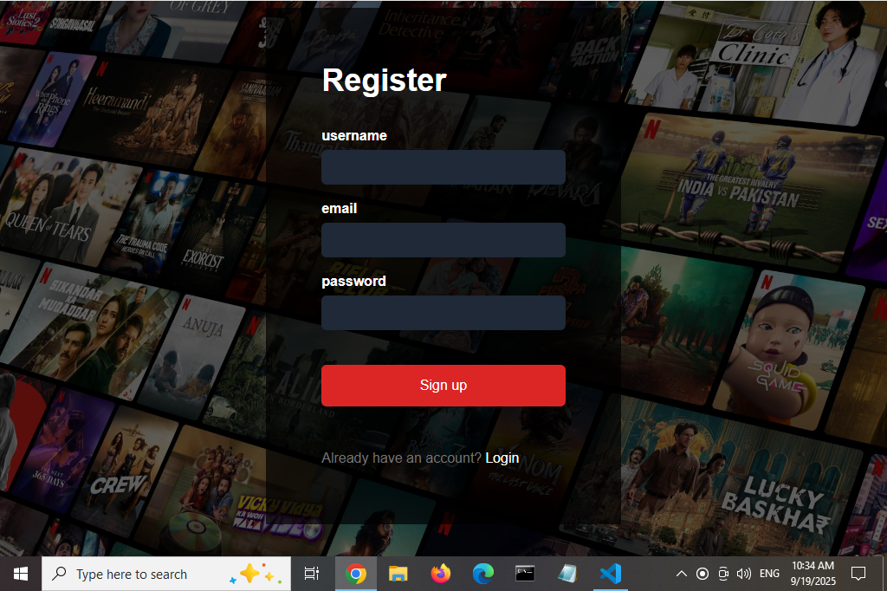
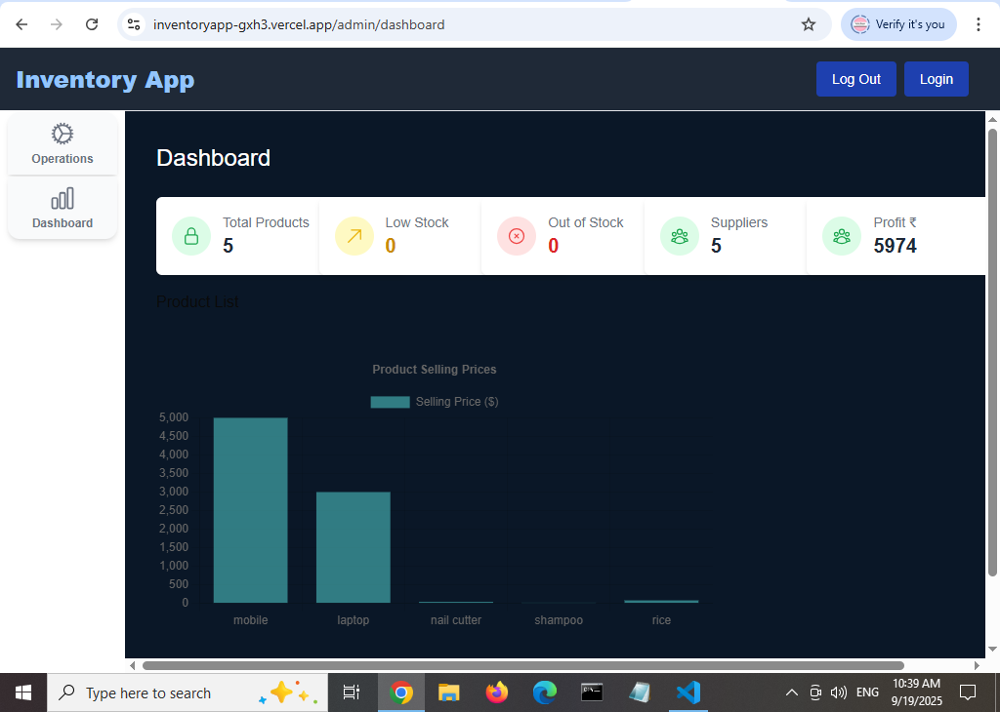
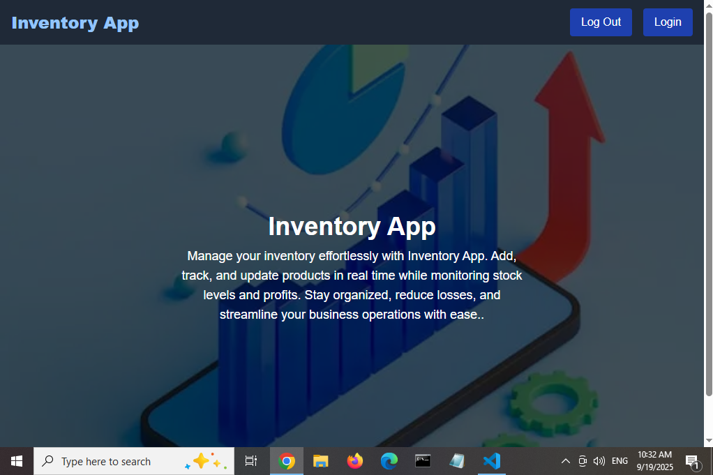
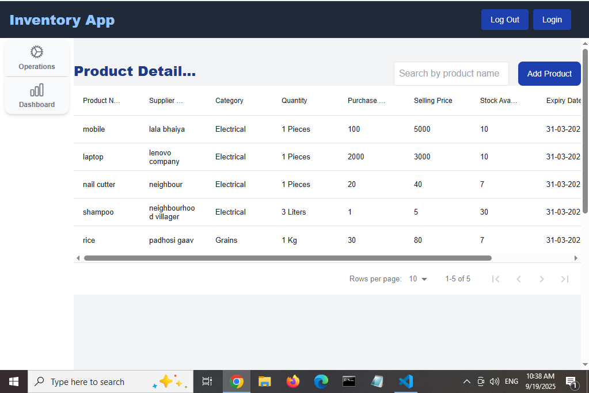

# 📦 Inventory Management System

A full-stack web app to manage products, track sales, and monitor profits with real-time analytics.

## Screenshots

### 1. Login Page  
  

### 2. Register Page  
  

### 3. Dashboard
  

### 4. Inventory Home Page  
  

### 5. Operation 
  


## 🚀 Features
- Add, update, and delete products
- Secure login/signup with JWT authentication
- Dashboard with product analytics and charts
- Search and filter functionality

## 🛠 Tech Stack
- Frontend: React, Next.js, Tailwind CSS
- Backend: Node.js, Express, MongoDB (Mongoose)
- Deployment: Render, Vercel

## Live demo
https://inventoryapp-gxh3.vercel.app/

## Api Routes
http://localhost:3000/
http://localhost:3000/admin/products
http://localhost:3000/admin/dashboard
http://localhost:3000/auth   

## 👩‍💻 Author

**Priyanka Sahu**  
- GitHub: [(https://github.com/CodeWithSony)
    
- LinkedIn: [Priyankasahu(https://www.linkedin.com/in/priyanka-sahu-444a21242 )
  
- Portfolio:
(https://portfolio-two-silk-78.vercel.app/)  
- Email: sahu.priyanka2122@gmail.com

## ⚡ Installation
```bash
git clone https://github.com/codewithsony/inventory-app.git
cd inventory-app
npm install
npm run dev


